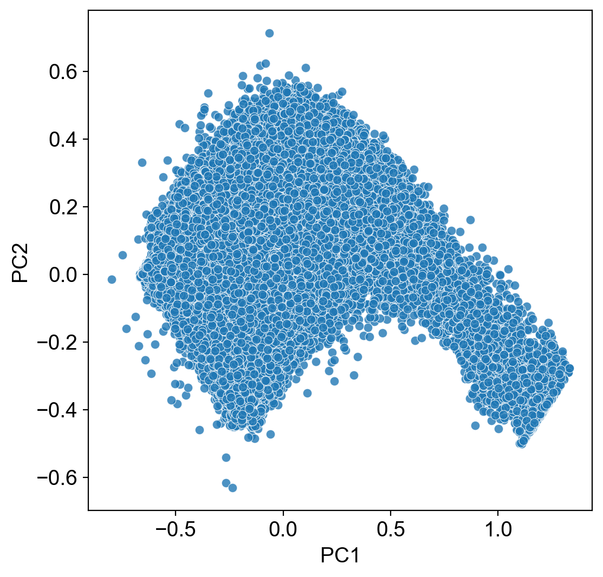
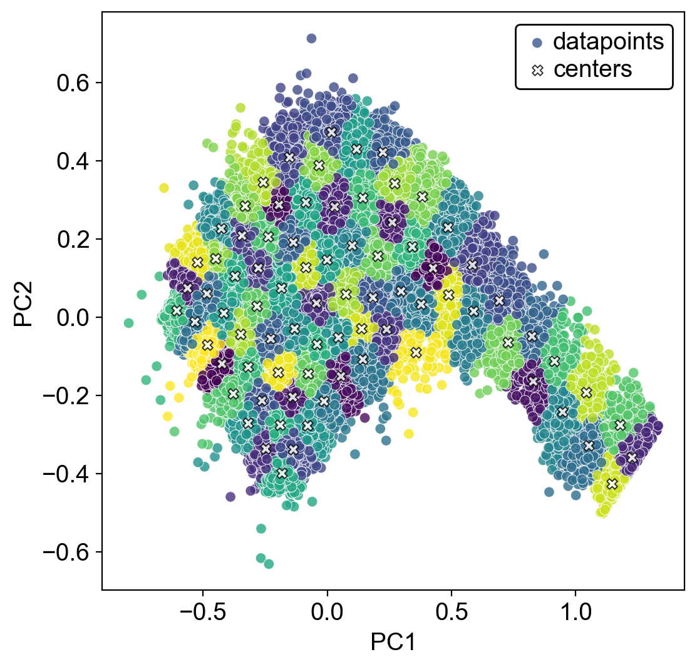

## Clustering (Python code)
The database of high-error structures usually contains too many data points. Fortunately, clustering methods, such as k-means, can help to find the most informative data points and add only them to our database. To do that, we prepared a Python notebook, which can be found [in this repository](https://github.com/wgst/ml-gas-surface/blob/main/scripts/dynamics/dissociative_chemisorption/adaptive_sampling/high_error_structure_clusters/choosing_datapoints_h2cu111_v0_clean.ipynb). Its contents with an explanation are also included below.

### Import database with high-error structures

```py
import matplotlib
import matplotlib.pyplot as plt
from ase.io import write, read
import numpy as np

db_p = 'output_h2cu111_example.db' # Input db path
db_out_p = 'h2cu_clust_centr.xyz' # Path for saving cluster centres
ncluster = 80 # Number of clusters (final structures that will be added to our database)
# Read all high error structures
struct_all = read(f'{db_p}@:')
```

### Define descriptors (inverse distances)

```py
dist_all = []
H2_dist = np.zeros((len(struct_all),3))
# For H2 get the minimum distance to all atoms
for j in range(len(struct_all)):
    dist_cur = struct_all[j].get_all_distances(mic=True)
    # Save dist_all list for inverse distance matrix later
    dist_all.append(dist_cur)
    # Minimal descriptor
    H2_dist[j][0] = dist_cur[-1,-2] # Distance between H-H
    H2_dist[j][1] = np.min(dist_cur[-1,:-2]) # Min distance between H1-Cu
    H2_dist[j][2] = np.min(dist_cur[-2,:-2]) # Min distance between H2-Cu

natoms = len(struct_all[0].get_all_distances())
invd = np.zeros((len(dist_all),natoms,natoms))

# Make 1s out of the diagonal
for i in range(len(dist_all)):
    np.fill_diagonal(dist_all[i],1.0)
    invd[i] = np.ones((natoms,natoms))/dist_all[i]

# We will use invd[:,-2:], which refers to the inverse distances between both H atoms and all atoms
invd_reduced = invd[:,-2:]
invd = invd.reshape(len(dist_all),natoms*natoms)
invd_reduced = invd_reduced.reshape(len(dist_all),-1)
descr = invd_reduced
```

### Use PCA for dimension reduction (optional)

```py
from sklearn.decomposition import PCA

pca = PCA(n_components=10)
pca.fit(descr)
print(pca.explained_variance_ratio_)
print(pca.singular_values_)
X_new = pca.transform(descr)

plt.xlabel("PCA components")
plt.ylabel("Variance ratio")

plt.bar(np.arange(10),pca.explained_variance_ratio_, edgecolor='black')
```

<!--  -->


```py
descr = X_new[:,:2]
fig, ax = plt.subplots(1, 1)

ax.scatter(descr[:,0], descr[:,1], edgecolors='white', linewidths=0.4, label="datapoints", alpha=0.8)

plt.xlabel("PC1")
plt.ylabel("PC2")
fig.set_figheight(6.0)
fig.set_figwidth(6.0)

plt.show()
```

<!--  -->


```py
from sklearn.cluster import MiniBatchKMeans

niter = 1000000
minibatch = 1800 # Batch size (how many data points are treated in the algorithm at once, reduce if you run out of memory)
kmeans = MiniBatchKMeans(n_clusters=ncluster,
                        init="k-means++",
                        max_iter=niter,
                        batch_size=minibatch)
# Fit the clustering model
km = kmeans.fit(np.array(descr).reshape(-1,1))
# Use the clustering model to predict the cluster number of each data point
indices = km.fit_predict(descr)
```

### Finding centers of clusters

```py
from sklearn.metrics.pairwise import pairwise_distances_argmin

centroid = kmeans.cluster_centers_
b = np.inf
ind = pairwise_distances_argmin(centroid, descr)
print(ind)

geometries = []
X_centers = []
H2_centers = []

for i in range(len(ind)):
    geometries.append(struct_all[ind[i]])
    X_centers.append(X_new[ind[i]])
    H2_centers.append(H2_dist[ind[i]])

# Save the chosen center structures
write(db_out_p, geometries)

H2_centers = np.array(H2_centers)
X_centers = np.array(X_centers)
```

### Plotting the final centers within PCs

```py
fig, ax = plt.subplots(1, 1)

ax.scatter(X_new[:,0], X_new[:,1],c=indices, edgecolors='white', linewidths=0.4, label="datapoints", alpha=0.8)
ax.scatter(X_centers[:,0],X_centers[:,1],color="white",label="centers",edgecolors='black',linewidths=0.7,marker="X", alpha=0.8)

plt.legend(fancybox=True,framealpha=1,edgecolor='black',handletextpad=0.05,borderpad=0.3,handlelength=1.2,columnspacing=0.4,labelspacing=0.2,ncol=1,loc=1, fontsize="medium") #, bbox_to_anchor=(1.75, 1.02))
plt.xlabel("PC1")
plt.ylabel("PC2")
fig.set_figheight(6.0)
fig.set_figwidth(6.0)

plt.show()
```
<!--  -->

### Plotting centers of clusters within H-H and H1-Cu distances

```py

fig, ax = plt.subplots(1, 1)

ax.scatter(H2_dist[:,0], H2_dist[:,1],c=indices,edgecolors='white', linewidths=0.4, label="datapoints", alpha=0.8)
ax.scatter(H2_centers[:,0],H2_centers[:,1],color="white",label="centers",edgecolors='black',linewidths=0.7,marker="X", alpha=0.8)

plt.legend(fancybox=True,framealpha=1,edgecolor='black',handletextpad=0.05,borderpad=0.3,handlelength=1.2,columnspacing=0.4,labelspacing=0.2,ncol=1,loc=1, fontsize="medium") #, bbox_to_anchor=(1.75, 1.02))
plt.xlabel("H1-H2 distance / Å")
plt.ylabel("H1-Cu distance / Å")
fig.set_figheight(6.0)
fig.set_figwidth(6.0)

plt.show()

```
<!-- 
 -->


